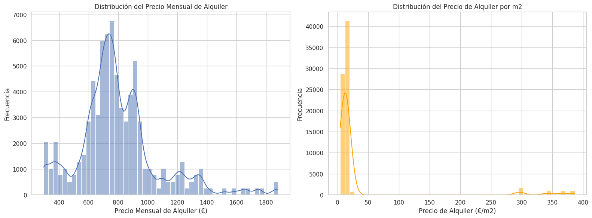
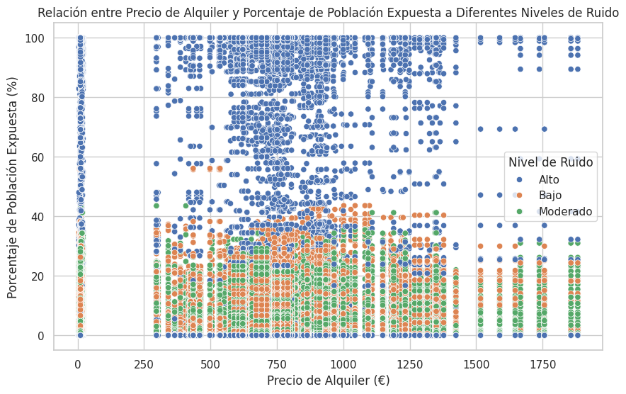

# Análisis de Calidad de Vida y Coste de Alquiler en Barcelona
## Introducción
Este proyecto tiene como objetivo analizar cómo diferentes factores relacionados con la calidad de vida afectan el coste del alquiler en la ciudad de Barcelona. Los conjuntos de datos principales utilizados en este estudio incluyen información detallada sobre el costo medio de alquiler en diferentes barrios y distritos, así como datos sobre la exposición al ruido.

## Variables Seleccionadas
* Costo medio de alquiler mensual (€/mes)
* Costo medio de alquiler por superficie (€/m²)
* Niveles de ruido (en dB)
* Localización (barrios y distritos)

## Depuración de Datos
Se llevaron a cabo varios pasos para depurar y preprocesar los datos:

* Limpieza de Datos
* Eliminación de registros duplicados.
* Imputación de valores nulos para el costo de alquiler, utilizando la media del distrito correspondiente.

## Transformación de Datos
* Conversión de variables categóricas a formato 'category' para optimizar el uso de memoria.
* Segmentación de niveles de ruido en categorías más generales ("Bajo", "Moderado", "Alto").

## Resultados
Se realizaron varios análisis exploratorios y gráficos para entender mejor la relación entre el costo de alquiler y otros factores como el nivel de ruido. Se encontró que:

**INISGHT 1: Distribución del precio de alquiler y el precio del m2**

* Distribución del Precio Mensual de Alquiler: Este gráfico muestra la distribución del precio mensual de alquiler en euros. La mayoría de los precios mensuales se concentran en el rango de aproximadamente 400 a 1.200 euros.

* Distribución del Precio de Alquiler por m²: Este gráfico muestra la distribución del precio de alquiler por metro cuadrado en euros. Aquí, la mayoría de los precios por m² se encuentran en el rango de aproximadamente 8 a 14 euros.
  

**INSIGHT 2: Relación entre el Precio de Alquiler y el Porcentaje de Población Expuesta a Diferentes Niveles de Ruido**
* No parece haber una correlación clara entre el precio del alquiler y el porcentaje de población expuesta a diferentes niveles de ruido. Sin embargo, es interesante notar que las áreas con niveles de ruido "Alto" tienden a tener un rango más amplio de precios de alquiler.

**Barrios con alta relación entre coste de alquiler y calidad de vida:**
* Pedralbes: El precio medio de alquiler más alto (aproximadamente 901 €) con bajos niveles de ruido (alrededor del 6% de la población expuesta a ruido bajo y alrededor del 20% a ruido alto).
* Les Tres Torres: Otro barrio con un precio medio de alquiler alto (aproximadamente 822 €), pero con un porcentaje más alto de población expuesta a ruido alto (aproximadamente 21%).

**Barrios con baja relación entre coste de alquiler y calidad de vida:**
* Ciutat Meridiana: Este barrio tiene el precio medio de alquiler más bajo (aproximadamente 222 €), pero alrededor del 21% de su población está expuesta a niveles altos de ruido.
* Torre Baró: Con un precio medio de alquiler de aproximadamente 243 €, este barrio tiene alrededor del 8% de su población expuesta a niveles bajos de ruido y aproximadamente el 4% a niveles moderados.

## Conclusiones
A partir de los resultados obtenidos, se puede inferir que:

Los patrones y correlaciones encontrados en este estudio ofrecen varias oportunidades para el diseño de políticas públicas:

* Reducción de Ruido: Las políticas podrían centrarse en la reducción del ruido en áreas específicas para aumentar la calidad de vida y posiblemente influir en los precios de alquiler.

* Información al Público: Los resultados podrían divulgarse a través de plataformas públicas para ayudar a los residentes a tomar decisiones más informadas sobre dónde vivir.

* Incentivos a Propietarios: Podrían ofrecerse incentivos para que los propietarios implementen medidas de reducción del ruido, lo que podría tener un efecto positivo en los precios de alquiler y la calidad de vida.

En resumen, los hallazgos de este estudio podrían usarse para formular políticas más efectivas y basadas en datos para mejorar la calidad de vida en Barcelona.
